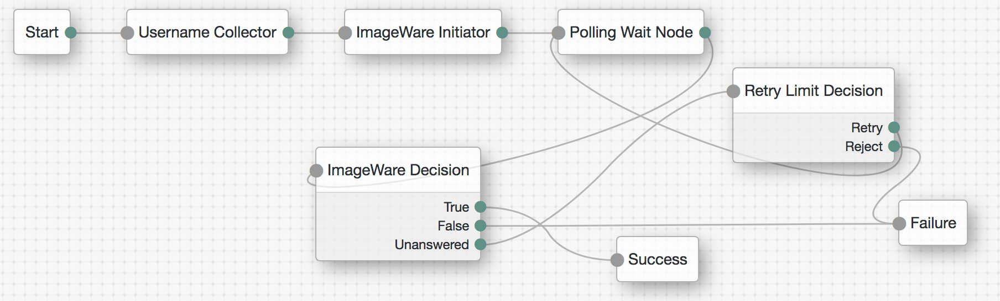
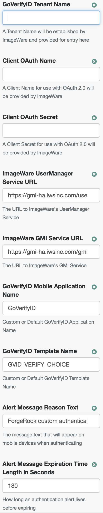
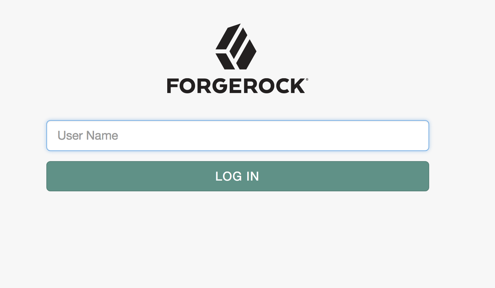
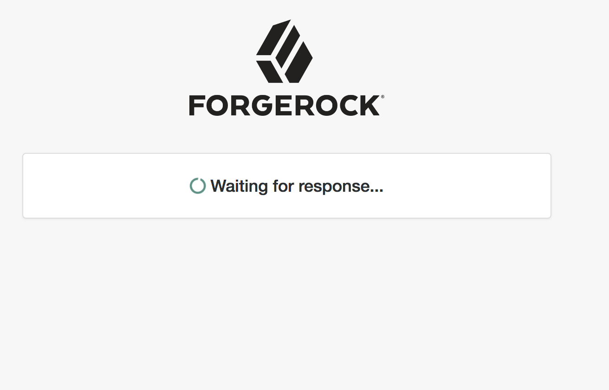
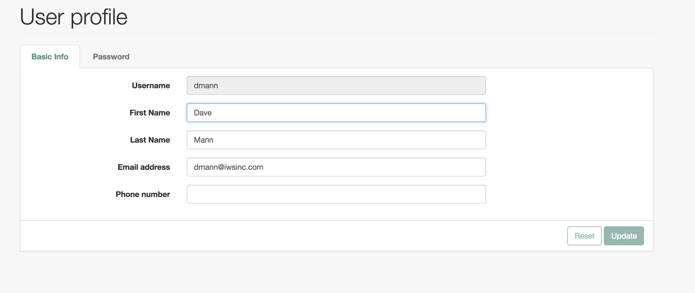
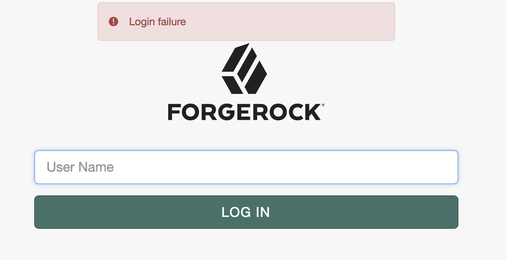

<!--
 * The contents of this file are subject to the terms of the Common Development and
 * Distribution License (the License). You may not use this file except in compliance with the
 * License.
 *
 * You can obtain a copy of the License at legal/CDDLv1.0.txt. See the License for the
 * specific language governing permission and limitations under the License.
 *
 * When distributing Covered Software, include this CDDL Header Notice in each file and include
 * the License file at legal/CDDLv1.0.txt. If applicable, add the following below the CDDL
 * Header, with the fields enclosed by brackets [] replaced by your own identifying
 * information: "Portions copyright [year] [name of copyright owner]".
 *
 * Copyright ${data.get('yyyy')} ForgeRock AS.
-->
# ImageAuthentication

A simple authentication node for ForgeRock's [Identity Platform][forgerock_platform] 5.5 and above. This node integrates with the ImageWare Biometric as a service platform, allowing users to verify identity via mobile device. An Tenant account with ImageWare Systems, Inc is required for usage.

Copy the .jar file from the ../target directory into the ../web-container/webapps/openam/WEB-INF/lib directory where AM is deployed.  Restart the web container to pick up the new node.  The node will then appear in the authentication trees components palette.

The ImageWare Initiator and ImageWare Decision nodes are meant to be used in a workflow with a Username Collector, Polling Wait Node and Retry Limit Decision node. See screenshots below for workflow layout.

The Username Collector node collects the user’s login name.
The ImageWare Initiator node 
   * Looks up the user’s email address in the local LDAP user store or fails in error if the user’s email cannot be found.
   * Retrieves an OAuth token from ImageWare’s User Manager or fails in error
   * Verifies the user belongs to the associated Tenant name or fails in error
   * Sends a biometric verification message to the user’s mobile device or fails in error
The Polling Wait Node controls the time delay before the ImageWare Decision node looks for the authentication response.
The Retry Limit Decision node controls how many times the ImageWare Decision node will try to process an authentication response.
The ImageWare Decision node
   * Looks for an authentication response to the original verification call and passes control back to the Retry Limit Decision node if none is found
   * Verifies the biometric authentication for the user and returns status of pass or fail

The code in this repository has binary dependencies that live in the ForgeRock maven repository. Maven can be configured to authenticate to this repository by following the following [ForgeRock Knowledge Base Article](https://backstage.forgerock.com/knowledge/kb/article/a74096897).

**SPECIFIC BUILD INSTRUCTIONS HERE**

Add ImageWares' public git repo to your maven environment.
> mvn package

**SCREENSHOTS ARE GOOD LIKE BELOW**

Workflow example:

ImageWare Initiator settings example:

Sample login page:

Sample waiting page:

Sample successful login to user profile:

Sample failure to login:

        
The sample code described herein is provided on an "as is" basis, without warranty of any kind, to the fullest extent permitted by law. ForgeRock does not warrant or guarantee the individual success developers may have in implementing the sample code on their development platforms or in production configurations.

ForgeRock does not warrant, guarantee or make any representations regarding the use, results of use, accuracy, timeliness or completeness of any data or information relating to the sample code. ForgeRock disclaims all warranties, expressed or implied, and in particular, disclaims all warranties of merchantability, and warranties related to the code, or any service or software related thereto.

ForgeRock shall not be liable for any direct, indirect or consequential damages or costs of any type arising out of any action taken by you or others related to the sample code.

[forgerock_platform]: https://www.forgerock.com/platform/  
